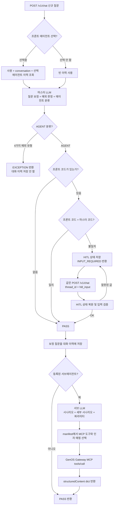

# SC_AX 마스터·서브에이전트 채팅 API

SC_AX는 카드 모집인 업무 질문을 처리하기 위한 FastAPI 기반 에이전트
애플리케이션입니다.

현재 구현 범위는 다음과 같습니다.

1. Redis 또는 메모리에서 이전 대화 조회
2. GenOS LLM을 이용한 질문 보정과 마스터 의도분류
3. 프론트 선택 에이전트와 마스터 분류 결과 비교
4. 코드 불일치 시 Redis 기반 HITL 확인
5. 등록된 서브에이전트의 시나리오·세부 시나리오·파라미터 분류
6. 세부 시나리오 manifest에 정의된 GenOS MCP 도구 호출
7. 분류 및 MCP 결과 반환
8. 로컬 CSV에 질의별 최종 처리 결과 기록

LangGraph Checkpointer와 `langgraph.interrupt()`는 사용하지 않습니다. 대화
이력은 일반 Redis List, HITL 상태는 일반 Redis String으로 직접 관리합니다.
따라서 `langgraph-checkpoint-redis`, RedisJSON, RediSearch가 필요하지 않습니다.

---

## 1. 전체 처리 흐름



중요한 처리 원칙:

- 서브에이전트에는 사용자의 원문이 아니라 마스터가 만든 `refined_query`를
  전달합니다.
- 모든 마스터 예외 유형은 Redis 대화 이력에 저장하지 않습니다.
- 프론트에서 에이전트를 선택하지 않으면 코드 비교 없이 마스터 분류 결과로
  진행합니다.
- MCP 실패는 이미 완료된 마스터·서브 분류를 HTTP 500으로 바꾸지 않습니다.
  `mcp.succeeded=false`와 `mcp.error`로 반환합니다.

---

## 2. 주요 기술

- Python 3.12
- FastAPI
- LangChain
- `langchain_openai.ChatOpenAI`
- LangGraph
- Pydantic Structured Output
- 일반 Redis
- GenOS OpenAI 호환 LLM API
- GenOS Gateway MCP JSON-RPC API

설치 패키지는 [requirements.txt](requirements.txt)에 정의되어 있습니다.

---

## 3. 식별자 구분

| 필드 | 생성 주체 | 의미 |
|---|---|---|
| `employee_id` | 프론트 | 사원별 데이터 격리 |
| `conversation_id` | 프론트, 생략 시 서버 | 여러 질문을 연결하는 멀티턴 대화 ID |
| `thread_id` | 서버 | 한 번의 질문과 그 질문의 HITL 흐름 ID |
| MCP `request_id` | 서버 | 프로젝트·사원·대화·질의를 연결하는 MCP 추적 ID |

### conversation_id

같은 사용자가 여러 질문을 이어서 할 때 동일한 값을 전달합니다.

```text
1턴: 이번 달 수수료 내역을 알려줘
2턴: 그중 세금은?
```

두 요청의 `employee_id`, `conversation_id`, `frontend_agent_code`가 같으면
2턴의 마스터 분류에 1턴 이력이 포함됩니다.

### thread_id

서버가 신규 `/v1/chat` 요청마다 UUID를 생성합니다. 일반적인 요청 추적 ID와
비슷하지만, HITL이 발생하면 프론트가 후속 요청에 동일한 `thread_id`를 다시
전달해야 합니다.

`conversation_id` 하나에는 여러 `thread_id`가 존재할 수 있습니다.

---

## 4. 마스터 의도분류

마스터는 다음 세 가지를 한 번에 수행합니다.

1. 이전 대화를 이용한 오탈자·생략 문맥 보정
2. 예외 유형 판정
3. 6개 업무 에이전트 중 하나 선택

### 분류 유형

| 값 | 의미 | agent_code |
|---|---|---|
| `AGENT` | 정상 업무 질문 | 필수 |
| `EMPTY_QUERY` | 질문이 비었거나 의도를 판단할 수 없음 | `null` |
| `OUT_OF_SCOPE` | 카드 모집인 업무와 무관함 | `null` |
| `OTHER_RECRUITER_DATA_REQUEST` | 본인이 아닌 다른 모집인의 데이터 조회 요구 | `null` |
| `CUSTOMER_DETAIL_REQUEST` | 자신의 고객이라도 특정 고객의 상세 내용·정보 요구 | `null` |

`OTHER_RECRUITER_DATA_REQUEST`와 `CUSTOMER_DETAIL_REQUEST`는 업무 키워드가
포함되어 있어도 에이전트 분류보다 우선합니다. 두 유형 모두 서브에이전트와
MCP를 호출하지 않고 `EXCEPTION`으로 종료하며 대화 이력에도 저장하지 않습니다.

### 마스터 에이전트 코드

- `PERFORMANCE_FEE`
- `QUALIFICATION`
- `RP`
- `FEE_POLICY`
- `PRODUCT_GUIDE`
- `TABLET`

에이전트 목록은 Python Enum에 하드코딩하지 않습니다.
`prompts/intent-classification/{version}/manifest.yaml`에서 읽어 Pydantic JSON
Schema Enum을 실행 시점에 생성합니다.

### RP와 PERFORMANCE_FEE의 중복 업무

현재 두 에이전트가 공통으로 지원하는 기능은 다음 두 가지입니다.

- 복합판매 구분코드별 환산점수 및 실적 건수 조회
- 환산 미반영 내역 조회

분류 규칙:

| 프론트 선택 | 공통 복합환산 질문의 마스터 결과 |
|---|---|
| `RP` | `RP` 유지, HITL 없음 |
| `PERFORMANCE_FEE` | `PERFORMANCE_FEE` 유지 |
| 미선택 | 기본 `PERFORMANCE_FEE` |

수수료·세금·실지급액·12개월 추이·원천징수는 공통 업무가 아닙니다. 해당
조회는 `PERFORMANCE_FEE` 업무입니다.

---

## 5. 프롬프트 버전 및 결합 방식

### 마스터 프롬프트

```text
prompts/intent-classification/
├── active.yaml
└── v1/
    ├── manifest.yaml
    ├── router/
    │   ├── system.md
    │   └── agents.md
    └── agents/
        ├── performance_fee.md
        ├── qualification.md
        ├── rp.md
        ├── fee_policy.md
        ├── product_guide.md
        └── tablet.md
```

`PromptBundleLoader`는 다음 순서로 프롬프트를 합칩니다.

1. router system 프롬프트
2. router agents 프롬프트
3. manifest의 `agent_code` 순서에 해당하는 에이전트 Markdown
4. 아직 선언되지 않은 나머지 Markdown

`INTENT_PROMPT_VERSION`이 없으면 `active.yaml`의 버전을 사용합니다.

### 서브에이전트 프롬프트

실제 로더가 사용하는 루트는 `prompts/subagents`입니다.

```text
prompts/subagents/
├── registry.yaml
├── performance-fee/
├── rp/
└── qualification/
```

각 에이전트는 다음 구조를 사용합니다.

```text
{agent-directory}/
├── active.yaml
└── v1/
    ├── manifest.yaml
    ├── system.md
    └── scenarios/
```

`manifest.yaml`이 정의하는 내용:

- 에이전트 코드와 프롬프트 버전
- 시나리오 및 세부 시나리오 코드
- 파라미터 정의와 기본값
- 기준일자 우선순위
- 세부 시나리오별 MCP 도구 이름
- MCP 인자 매핑

> `prompts/subagents/subagents_prompt`는 현재 활성 로더가 참조하지 않는 중복
> 복사본입니다. 실제 수정 대상은 바로 아래의 `performance-fee`, `rp`,
> `qualification`입니다. 혼동을 막으려면 중복 트리는 별도 정리하는 것이
> 좋습니다.

---

## 6. 현재 등록된 서브에이전트

`prompts/subagents/registry.yaml` 기준으로 세 개가 활성화되어 있습니다.

| 서브에이전트 | 시나리오 수 | 세부 시나리오 수 |
|---|---:|---:|
| `PERFORMANCE_FEE` | 5 | 11 |
| `RP` | 4 | 5 |
| `QUALIFICATION` | 4 | 6 |
| 합계 | 13 | 22 |

### PERFORMANCE_FEE

로그인한 카드 모집인 본인의 실적·환산점수·수수료를 조회합니다.

- 실적 종합조회
- 복합환산조회
  - 복합판매 구분코드별 환산점수 및 실적 건수
  - 환산 미반영 내역
- 미등록 회원 조회
- 폐기 수수료 조회
- 수수료 내역 조회

### RP

RP 신청 기준·정책과 RP 화면에서 지원하는 조회를 처리합니다.

- RP 업무 문서 조회
- 아파트관리비 RP 연결 가능 단지 조회
- 실적 종합조회
- 복합환산조회
  - `COMPOSITE_CONVERSION_SCORE`
  - `COMPOSITE_CONVERSION_EXCLUDED`

RP에는 수수료·세금·실지급액·원천징수 세부 시나리오가 없습니다.

### QUALIFICATION

카드 입회 자격기준 문서 5개와 제한 요청 분기를 처리합니다.

자격기준 문서:

1. 일반 신규 개인회원 입회 자격기준
2. 외국인 입회 자격기준
3. 미성년자 입회 자격기준
4. 가족카드 발급 및 자격기준
5. 소득증빙 인정서류 확인 기준

추가 제한 요청:

- 가처분 문의

개인회원 세부 시나리오는 `member_category`를 다음 코드 중 하나로
반환합니다.

- `NEW_MEMBER`
- `FOREIGNER`
- `MINOR`

가처분 요청은 `restricted_request_type`을 다음 코드로 반환합니다.

- `PROVISIONAL_DISPOSITION`

파라미터는 manifest의 `allowed_values`로 Pydantic JSON Schema Enum이
생성됩니다. 세부 시나리오가 확정되면 `VALUE:` 기본값 정책도 같은 코드를
보장하므로 LLM이 임의 문자열을 반환하거나 필수 코드를 누락하는 문제를
방지합니다.

고객의 개인정보 또는 고객 단위 상세 내용 요구는 QUALIFICATION까지 전달하지
않고 마스터의 `CUSTOMER_DETAIL_REQUEST` 예외로 종료합니다.

---

## 7. 날짜 파라미터 처리

LLM은 질문에 명시된 날짜만 추출합니다. 당월·전월·전년도 같은 기본값은
애플리케이션이 manifest 규칙을 이용해 계산합니다.

지원 형식:

- `closing_year_month`: `YYYYMM`
- `reference_date`: `YYYYMMDD`
- `reference_year`: `YYYY`

`clear_when_present`가 설정된 세부 시나리오는 `reference_date`가 있으면
`closing_year_month`를 `null`로 정리합니다.

---

## 8. GenOS LLM 연결

LLM 엔드포인트:

```text
{GENOS_URL}/api/gateway/rep/serving/{GENOS_SERVING_ID}/v1
```

`ChatOpenAI`에는 다음 값이 전달됩니다.

- `base_url`: 위 GenOS `/v1` URL
- `model`: `GENOS_MODEL`
- `api_key`: `GENOS_BEARER_TOKEN`
- `temperature`: 프롬프트 manifest 값

마스터와 서브에이전트 모두 `with_structured_output(...,
method="json_schema", strict=True)` 방식의 Pydantic JSON Schema 결과를
사용합니다. 키워드 기반 대체 분류기는 없습니다. 토큰이 없으면 앱 초기화 단계에서
명확하게 실패합니다.

전체 프롬프트를 출력하는 `logger.info` 블록은 보안과 로그 크기 때문에 현재
주석 처리되어 있습니다.

---

## 9. MCP 호출

MCP 엔드포인트:

```text
{GENOS_URL}/api/gateway/mcp/{MCP_ID}/mcp
```

호출 형식:

```json
{
  "jsonrpc": "2.0",
  "id": "acqsc:EMP001:conversation-001:thread-uuid",
  "method": "tools/call",
  "params": {
    "name": "test_tool",
    "arguments": {
      "param1": "data1",
      "param2": "data2"
    }
  }
}
```

MCP 인자 source:

| source | 의미 |
|---|---|
| `literal` | manifest에 적은 고정값 |
| `parameter` | 서브에이전트가 추출한 파라미터 |
| `context` | 프로젝트·사원·대화·thread·시나리오 정보 |

현재 모든 세부 시나리오는 공통 테스트 도구인 `test_tool`을 사용합니다. 실제
업무 도구로 바꾸는 방법은
[MCP 시나리오 커스터마이징 가이드](docs/MCP_SCENARIO_CUSTOMIZATION_GUIDE.md)를
참고합니다.

MCP 응답은 일반 JSON과 SSE `data:` 형식을 모두 지원합니다. 최종 API에는
JSON-RPC 응답의 `result.structuredContent` dict만 `mcp.result`로 전달합니다.

---

## 10. Redis 대화 이력

Redis 키:

```text
{project_code}:{history_prefix}:{employee_id}:{conversation_id}:{AGENT_CODE}
```

기본 예:

```text
acqsc:chat:history:EMP001:conversation-001:PERFORMANCE_FEE
```

이력은 사원번호·conversation·agent_code가 모두 같은 경우에만 조회됩니다.
Redis List에는 보정된 사용자 질문을 JSON 문자열로 저장합니다.

### Redis 장애 정책

Redis 대화 이력이 꺼져 있거나 연결할 수 없으면:

- 최근 이력은 빈 목록으로 처리
- 이력 저장은 생략
- 현재 질문의 분류와 응답은 계속 진행

### 프론트 에이전트 미선택

마스터 분류 전에 어느 에이전트 이력을 가져와야 할지 결정할 수 없으므로 빈
이력으로 분류합니다. 분류가 끝난 후 최종 agent_code 범위에 보정 질문을
저장합니다.

---

## 11. Redis 기반 HITL

HITL은 LangGraph Checkpointer가 아니라 일반 Redis `SET`, `GET`, `DEL`로
관리합니다.

Redis 키:

```text
{project_code}:{hitl_prefix}:{thread_id}
```

기본 예:

```text
acqsc:hitl:state:550e8400-e29b-41d4-a716-446655440000
```

저장 정보:

- 프로젝트 코드
- thread_id
- HITL 유형
- 재진입에 필요한 최소 그래프 상태
- 프론트 입력 폼
- 최초 생성·최종 갱신 시각

현재 구현된 HITL 유형은 `AGENT_CODE_MISMATCH`입니다.

### HITL 재진입

별도 `/resume` API를 사용하지 않습니다. 동일한 `/v1/chat`에
`thread_id + hitl_input`을 전달합니다. 그래프는 Redis 상태의 `hitl_type`을
읽고 해당 검증 Edge부터 새로운 실행을 시작합니다. 마스터 LLM 분류는 다시
호출하지 않습니다.

HITL 상태는 TTL이 적용되고, 정상 승인이 끝나면 삭제됩니다.

### 장애 정책

HITL 상태를 저장하지 못한 채 `INPUT_REQUIRED`를 반환하면 사용자가 재개할 수
없습니다. 따라서 HITL Redis 장애는 숨기지 않고 HTTP 503으로 반환합니다.

---

## 12. 저장소 백엔드 선택

### 개발 PC

```env
CHAT_HISTORY_BACKEND=memory
HITL_STATE_BACKEND=memory
```

- Redis 없이 멀티턴과 HITL 테스트 가능
- 같은 프로세스 안에서만 유지
- 서버 재시작, `--reload`, 다중 워커, 여러 Pod 사이에서는 공유되지 않음

단순 의도분류만 확인하고 이력이 필요 없으면:

```env
CHAT_HISTORY_BACKEND=empty
HITL_STATE_BACKEND=memory
```

### 운영

```env
CHAT_HISTORY_BACKEND=redis
HITL_STATE_BACKEND=redis
```

여러 워커나 Pod가 같은 Redis를 바라보면 대화 이력과 HITL 상태를 공유할 수
있습니다.

---

## 13. 환경변수

```dotenv
# 프로젝트와 로그
PROJECT_CODE=acqsc
LOG_LEVEL=INFO
PORT=8080

# GenOS LLM
GENOS_URL=https://genos.genon.ai
GENOS_SERVING_ID=850
GENOS_MODEL=qwen/qwen3.7-flash
GENOS_BEARER_TOKEN=<secret>
INTENT_PROMPT_VERSION=v1

# 대화 이력
CHAT_HISTORY_BACKEND=memory
REDIS_URL=redis://localhost:6379/0
REDIS_HISTORY_KEY_PREFIX=chat:history
CHAT_HISTORY_LIMIT=10
REDIS_DEDUPE_TTL_SECONDS=86400

# HITL
HITL_STATE_BACKEND=memory
REDIS_HITL_KEY_PREFIX=hitl:state
REDIS_HITL_TTL_SECONDS=3600

# GenOS MCP
MCP_BACKEND=http
MCP_ID=475
MCP_BEARER_TOKEN=<secret>
MCP_TIMEOUT_SECONDS=30

# 로컬 CSV 진단
CSV_TRACE_ENABLED=true
CSV_TRACE_DIR=data/intent_traces
```

주의:

- `GENOS_BEARER_TOKEN`은 필수입니다.
- `MCP_BACKEND=http`이면 `MCP_BEARER_TOKEN`도 필수입니다.
- 토큰을 소스나 README에 실제 값으로 저장하지 마십시오.
- 배포에서는 Kubernetes Secret 또는 동등한 비밀 저장소를 사용하십시오.

---

## 14. 설치와 실행

### Conda 환경

```bash
conda create -n sc_ax python=3.12 -y
conda activate sc_ax
python -m pip install -r requirements.txt
```

### Linux 또는 WSL 실행

```bash
uvicorn main:app \
  --env-file .env \
  --host 0.0.0.0 \
  --port 8080
```

개발 중 자동 재시작:

```bash
uvicorn main:app \
  --env-file .env \
  --host 0.0.0.0 \
  --port 8080 \
  --reload
```

WSL의 `/mnt/c`에서 `watchfiles` 오류가 발생하면:

```bash
WATCHFILES_FORCE_POLLING=true uvicorn main:app \
  --env-file .env \
  --host 0.0.0.0 \
  --port 8080 \
  --reload
```

프로젝트에 포함된 실행 스크립트를 사용하면 polling과 캐시 제외 설정을 자동으로
적용합니다.

```bash
bash scripts/run_dev_wsl.sh
```

환경파일·호스트·포트 변경:

```bash
ENV_FILE=.env HOST=0.0.0.0 PORT=8080 bash scripts/run_dev_wsl.sh
```

`_rust_notify.WatchfilesRustInternalError`가 `.pytest_cache`의
`Permission denied (os error 13)`을 가리키는 경우는 FastAPI 애플리케이션
오류가 아니라 WSL이 `/mnt/c`의 파일 감시를 시작하지 못한 것입니다. 이
프로젝트의 `pytest.ini`는 pytest 캐시 플러그인을 비활성화하므로 앞으로
`.pytest_cache`를 생성하지 않습니다. 기존 폴더가 남아 있다면 서버를 끈 뒤
다음 명령으로 한 번만 삭제할 수 있습니다.

```bash
rm -rf -- /mnt/c/Users/user/Desktop/Project/SC_AX/.pytest_cache
```

운영에서는 `--reload`를 사용하지 않습니다.

### 직접 실행

```bash
python main.py
```

`PORT` 환경변수가 없으면 8080 포트를 사용합니다.

---

## 15. 접속 주소

| 기능 | URL |
|---|---|
| 테스트 화면 | `http://127.0.0.1:8080/tester` |
| Swagger UI | `http://127.0.0.1:8080/docs` |
| 상태 확인 | `http://127.0.0.1:8080/health` |
| 메타데이터 | `http://127.0.0.1:8080/v1/metadata` |
| 채팅 | `POST http://127.0.0.1:8080/v1/chat` |

테스트 화면의 에이전트 목록은 HTML에 하드코딩하지 않고 `/v1/metadata`에서
불러옵니다.

---

## 16. Postman 요청 예시

### 에이전트를 선택한 신규 질문

```http
POST /v1/chat
Content-Type: application/json
```

```json
{
  "message": "이번 달 복합환산 미반영 내역을 알려주세요.",
  "employee_id": "EMP001",
  "conversation_id": "conversation-001",
  "frontend_agent_code": "RP"
}
```

RP가 해당 공통 업무를 지원하므로 정상 분류되면 HITL 없이 서브에이전트와 MCP까지
진행합니다.

```json
{
  "status": "PASS",
  "thread_id": "서버가 생성한 UUID",
  "classification": {
    "refined_query": "이번 달 복합환산 미반영 내역을 알려주세요.",
    "classification_type": "AGENT",
    "agent_code": "RP"
  },
  "subagent": {
    "agent_code": "RP",
    "prompt_version": "v1",
    "scenario_code": "COMPOSITE_CONVERSION",
    "scenario_name": "복합환산조회",
    "detail_scenario_code": "COMPOSITE_CONVERSION_EXCLUDED",
    "detail_scenario_name": "환산 미반영 내역 조회",
    "parameters": {
      "address": null,
      "closing_year_month": "202607",
      "reference_date": null
    }
  },
  "mcp": {
    "backend": "http",
    "tool_name": "test_tool",
    "request_id": "acqsc:EMP001:conversation-001:서버-thread-id",
    "arguments": {
      "param1": "data1",
      "param2": "data2"
    },
    "succeeded": true,
    "result": {},
    "error": null
  },
  "interrupt": null
}
```

날짜 기본값은 실행 날짜에 따라 달라지므로 위 `202607`은 형식 예시입니다.

### 에이전트를 선택하지 않은 신규 질문

`frontend_agent_code`를 생략하거나 `null`, `""`, 공백 문자열로 전달합니다.

```json
{
  "message": "내 환산 미반영 내역을 알려줘",
  "employee_id": "EMP001",
  "conversation_id": "conversation-001"
}
```

이 경우 프론트 코드 비교 없이 마스터 분류 결과로 진행합니다.

### 코드 불일치 응답

```json
{
  "status": "INPUT_REQUIRED",
  "thread_id": "서버가 생성한 UUID",
  "classification": {
    "refined_query": "내 수수료 세금과 실지급액을 조회해줘",
    "classification_type": "AGENT",
    "agent_code": "PERFORMANCE_FEE"
  },
  "subagent": null,
  "mcp": null,
  "interrupt": {
    "type": "AGENT_CODE_MISMATCH",
    "message": "선택한 에이전트와 질문 의도가 다릅니다.",
    "fields": [
      {
        "name": "signal",
        "label": "변경 승인",
        "type": "hidden",
        "required": true,
        "expected_value": "OK"
      }
    ],
    "context": {
      "frontend_agent_code": "RP",
      "classified_agent_code": "PERFORMANCE_FEE"
    },
    "errors": []
  }
}
```

### HITL 승인

같은 `/v1/chat`으로 요청합니다.

```json
{
  "thread_id": "INPUT_REQUIRED에서 받은 UUID",
  "hitl_input": {
    "signal": "OK"
  }
}
```

`thread_id`가 있는 HITL 요청에는 `message`, `employee_id`,
`frontend_agent_code`, `conversation_id`를 함께 보내지 않습니다.

---

## 17. API 상태와 오류

### 응답 status

| status | 의미 |
|---|---|
| `PASS` | 현재 구현된 전체 흐름 완료 |
| `INPUT_REQUIRED` | 프론트 입력을 기다리는 HITL 상태 |
| `EXCEPTION` | 네 가지 마스터 예외 유형 중 하나 |

### 주요 HTTP 오류

| HTTP | 코드/유형 | 의미 |
|---|---|---|
| 404 | `HITL_STATE_NOT_FOUND` | HITL TTL 만료, 잘못된 thread_id, 이미 처리된 상태 |
| 503 | `HITL_STATE_STORE_UNAVAILABLE` | HITL Redis 저장·조회·삭제 실패 |
| 422 | Pydantic/FastAPI 검증 | 필수 필드, 요청 모드 또는 에이전트 코드 오류 |

---

## 18. 테스트 화면 전용 API

테스트 HTML은 다음 API를 사용합니다.

- `GET /v1/tester/history`
  - 사원·conversation·agent_code 범위의 이력 조회
- `GET /v1/tester/conversations`
  - 현재 프로젝트의 conversation 목록 조회
- `DELETE /v1/tester/conversations`
  - 특정 사원·conversation의 모든 에이전트 이력 삭제

이 API들은 테스트 진단용이며 OpenAPI 문서에서는 숨겨져 있습니다.

---

## 19. 로컬 CSV 의도분류 추적

활성화:

```dotenv
CSV_TRACE_ENABLED=true
CSV_TRACE_DIR=data/intent_traces
```

생성 파일:

```text
data/intent_traces/intent_classification_trace.csv
```

CSV 파일은 하나만 사용하며, 하나의 `thread_id`가 하나의 행입니다.

- 신규 thread_id: 새 행 추가
- 같은 thread_id의 다음 단계: 기존 행 갱신
- HITL 재진입: 동일 행 갱신
- 다른 질문: 다음 행 추가

주요 컬럼:

- 최초 요청·최종 갱신 시각
- 현재 단계와 전체 단계 이력
- 프로젝트·thread·conversation·사원번호
- 원본 질문과 보정 질문
- 프론트 선택 코드
- 마스터 분류 유형과 에이전트 코드
- 서브에이전트·시나리오·세부 시나리오
- 추출 파라미터
- MCP 도구·추적 ID·인자·결과
- 최종 상태와 HITL 유형
- 마스터·서브·MCP 단계별 소요시간
- 오류 유형과 오류 내용

Windows Excel에서 한글을 바로 읽을 수 있도록 UTF-8 BOM으로 저장합니다. CSV
기록 실패는 채팅 API 오류로 전파하지 않고 로그만 남깁니다.

CSV에는 질문과 MCP 결과 등 업무 데이터가 들어갈 수 있으므로 운영에서는 접근
권한, 보존 기간, 삭제 정책을 별도로 정의해야 합니다.

---

## 20. 로그와 소요시간

로그는 각 단계를 다음 형태로 구분합니다.

```text
======== 통합 채팅 요청 도착
======== Redis 이력 조회
======== 1차 의도 분류 시작
======== LLM 전달
======== 서브에이전트 실행
======== MCP Payload 생성
======== MCP 실행 완료
```

공통 시간 측정 도구는 초 단위 소수점 세 자리로 출력합니다.

```text
1.245초
```

---

## 21. 테스트

전체 테스트:

```bash
python -m pytest -q
```

`pytest.ini`의 `-p no:cacheprovider` 설정 때문에 테스트 후에도 프로젝트 루트에
`.pytest_cache`가 생성되지 않습니다.

또는:

```bash
python -m unittest discover -s tests -v
```

현재 테스트 범위:

- FastAPI 신규·HITL 요청 검증
- 마스터 그래프 분기
- Redis 장애 fallback
- 메모리·Redis 대화 이력 격리
- Redis HITL 저장·조회·TTL·삭제
- 프롬프트 결합
- 동적 Pydantic Structured Output
- PERFORMANCE_FEE·RP·QUALIFICATION 시나리오
- MCP 도구·인자·추적 ID·응답 파싱
- 단일 CSV 파일과 thread_id별 한 행 갱신

Redis 서버가 없으면 Redis 통합 테스트만 건너뛰고 나머지 테스트는 실행할 수
있습니다.

---

## 22. 프로젝트 구조

```text
SC_AX/
├── main.py
├── requirements.txt
├── guide.ipynb
├── intent_classification.ipynb
├── app/
│   ├── api.py
│   ├── classifier.py
│   ├── config.py
│   ├── csv_trace.py
│   ├── domain.py
│   ├── graph.py
│   ├── history.py
│   ├── hitl.py
│   ├── hitl_store.py
│   ├── models.py
│   ├── observability.py
│   ├── prompt_loader.py
│   ├── mcp/
│   │   ├── client.py
│   │   └── models.py
│   └── subagents/
│       ├── models.py
│       ├── prompt_loader.py
│       └── router.py
├── prompts/
│   ├── intent-classification/
│   └── subagents/
├── static/
│   └── intent_tester.html
├── docs/
│   └── MCP_SCENARIO_CUSTOMIZATION_GUIDE.md
└── tests/
```

### 핵심 파일 역할

| 파일 | 역할 |
|---|---|
| `app/api.py` | FastAPI 조립과 `/v1/chat` 통합 API |
| `app/graph.py` | 신규·HITL 재진입 LangGraph 흐름 |
| `app/classifier.py` | GenOS 마스터 Structured Output 호출 |
| `app/history.py` | 대화 이력 메모리·Redis 구현 |
| `app/hitl_store.py` | HITL 상태 메모리·Redis 구현 |
| `app/subagents/router.py` | 서브에이전트 동적 스키마와 LLM 실행 |
| `app/mcp/client.py` | manifest 기반 GenOS MCP 실행 |
| `app/csv_trace.py` | thread_id당 한 행인 로컬 CSV 기록 |
