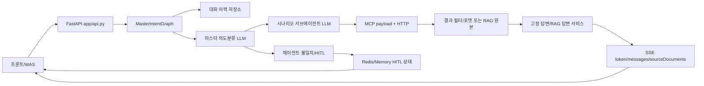
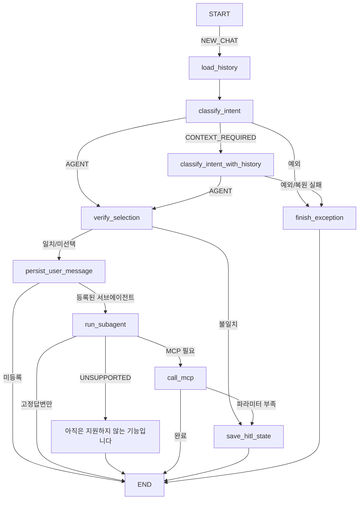

# 아키텍처와 실행 흐름

## 1. 시스템 개요

이 프로젝트는 FastAPI, LangGraph, LangChain/OpenAI 호환 GenOS API, GenOS MCP, Redis를 조합한 마스터/서브에이전트 채팅 서비스다.



실행 진입점은 [`main.py`](../main.py#L1)다. 모듈 import 시 [`create_app()`](../app/api.py#L49)을 즉시 호출하므로, 필수 환경변수가 없으면 Uvicorn 시작 전 import 단계에서 실패할 수 있다.

## 2. 애플리케이션 조립

[`create_app()`](../app/api.py#L49)은 다음 순서로 의존성을 만든다.

1. 로그 설정: [`configure_logging()`](../app/observability.py#L123)
2. 환경 설정: [`Settings.from_env()`](../app/config.py#L79)
3. 마스터 프롬프트: [`PromptBundleLoader.load()`](../app/prompt_loader.py#L36)
4. 마스터 분류기: [`create_classifier()`](../app/classifier.py#L208)
5. 대화 이력 저장소: [`create_history_store()`](../app/history.py#L979)
6. HITL 저장소: [`create_hitl_state_store()`](../app/hitl_store.py#L335)
7. 서브에이전트 registry: [`create_subagent_router()`](../app/subagents/router.py#L342)
8. MCP 실행기: [`create_mcp_tool_executor()`](../app/mcp/client.py#L717)
9. 최종 답변 서비스: [`create_answer_service()`](../app/answers.py#L751)
10. 로컬 CSV trace: [`create_trace_recorder()`](../app/csv_trace.py#L152)

FastAPI lifespan에서 이 객체들을 [`MasterIntentGraph`](../app/graph.py#L74)에 주입하고, 종료할 때 Redis/MCP/reranker 연결을 닫는다. 테스트나 별도 호스트에서는 `create_app()`의 키워드 인자로 가짜 구현을 주입할 수 있다.

## 3. 신규 질문 실행 흐름

### 3.1 API 입력에서 그래프까지

운영 SSE 기준 흐름은 다음과 같다.

1. [`StreamingChatRequest`](../app/models.py#L168)가 본문을 검증한다.
2. [`stream_chat()`](../app/api.py#L747)이 Bearer 헤더, `endpoint`, `agent_code`를 검증하고 null ID를 생성한다.
3. [`_resolve_employee_id()`](../app/api.py#L1237)이 `user.id`가 없으면 `session_id` SHA-256 기반 익명 ID를 만든다.
4. API가 `access_token`, `endpoint`, `recruitment_org_type_code`, `user`를 `request_context`로 묶는다. 위치: [`app/api.py:L804-L821`](../app/api.py#L804).
5. 신규 질문이면 [`MasterIntentGraph.start()`](../app/graph.py#L1128)을 호출한다.

### 3.2 LangGraph 노드 순서

그래프 구성은 [`MasterIntentGraph.__init__()`](../app/graph.py#L83)에 집중되어 있다.



핵심 노드별 입력·출력은 다음과 같다.

| 노드 | 읽는 상태 | 쓰는 상태 | 실제 구현 |
|---|---|---|---|
| `load_history` | employee/session/frontend agent | `history` | [`_load_history()`](../app/graph.py#L259) |
| `classify_intent` | message | 이력 없는 1차 `classification` | [`_classify_intent()`](../app/graph.py) |
| `classify_intent_with_history` | message + 동일 에이전트 history | 문맥 보정된 2차 `classification` | [`_classify_intent_with_history()`](../app/graph.py) |
| `verify_selection` | classification/frontend agent | status/approved/interrupt | [`_verify_selection()`](../app/graph.py#L405) |
| `persist_user_message` | refined query + 범위 | Redis 부수효과 | [`_persist_user_message()`](../app/graph.py#L677) |
| `run_subagent` | agent/refined query | `subagent` | [`_run_subagent()`](../app/graph.py#L734) |
| `call_mcp` | matches/parameters/request context | `mcp`, `mcp_workflow_results`, `mcp_results`, status | [`_call_mcp()`](../app/graph.py) |
| `save_hitl_state` | 최소 재개 상태/interrupt | 외부 상태 저장 | [`_save_hitl_state()`](../app/graph.py#L629) |
| `clear_hitl_state` | thread_id | 저장 상태 삭제 | [`_clear_hitl_state()`](../app/graph.py#L1116) |
| `finish_exception` | classification | `EXCEPTION` | [`_finish_exception()`](../app/graph.py#L391) |

## 4. 마스터 의도분류

[`GenOSIntentClassifier`](../app/classifier.py#L31)는 한 번의 호출에서 질문 보정과
에이전트 분류를 동시에 처리하지 않는다.

1. `router/refinement.md`와 `QueryRefinement` JSON Schema를 사용하는 의미 보존
   보정 LLM이 `refined_query/status/used_history`를 결정한다.
2. 보정 상태가 `COMPLETE`일 때만 결합된 마스터 분류 프롬프트와
   `IntentClassificationOutput` JSON Schema를 사용하는 별도 LLM 호출이
   `AGENT` 또는 `OUT_OF_SCOPE`를 결정한다.
3. 분류 LLM이 반환한 `refined_query`는 사용하지 않고 1단계 보정 결과를 유지한다.

프론트 선택 에이전트는 LLM에 전달하지 않는다. 따라서 사용자가 자격기준 화면에서
`원천징수 내역 알려줘`처럼 스스로 완결된 질문을 해도 이전 자격기준 대화나 선택
화면에 끌려가지 않고 `PERFORMANCE_FEE`로 독립 분류한 뒤, 그래프가
`SWITCH_AGENT` 확인을 만든다.

문맥 보정은 다음 두 모드로 동작한다.

1. `CURRENT_ONLY`: 현재 질문만 전달한다. 완결된 질문은 즉시 `AGENT` 또는 실제
   예외로 확정한다. `저번달은?`, `그중 세금은?`처럼 생략된 참조가 있어 이력이
   반드시 필요한 질문만 내부 유형 `CONTEXT_REQUIRED`로 반환한다.
2. `HISTORY_ALLOWED`: 1차 결과가 `CONTEXT_REQUIRED` 또는 일반
   `EMPTY_QUERY`일 때 최종 재판정으로 실행한다. Redis가 이미
   `employee_id + session_id + agent_code` 범위로 조회한 이력 중 관련 내용으로
   질문을 보정하고 다시 분류한다. 이력이 없어도 현재 질문이 완결되어 있으면
   `AGENT`로 복구하며, 현재 질문과 이력으로도 복원할 수 없을 때만 외부 응답
   유형을 `EMPTY_QUERY`로 정규화한다.

`CONTEXT_REQUIRED`는 LangGraph 내부 라우팅 전용이므로 정상 SSE 최종 결과나
예외 고정답변 코드로 노출되지 않는다.

출력 스키마는 [`create_structured_output_model()`](../app/domain.py#L43)이 master manifest의 에이전트 코드로 동적 Enum을 만든다. 도메인 검증상 `AGENT`이면 `agent_code`가 필수이고, 예외 유형이면 반드시 null이다.

마스터의 외부 예외 유형은 [`ClassificationType`](../app/domain.py#L8)의 다음 2개다.

- `EMPTY_QUERY`
- `OUT_OF_SCOPE`

예외는 서브에이전트/MCP/사용자 이력 저장 없이 종료되고, 답변 문구는 [`prompts/answer-generation/v1/manifest.yaml`](../prompts/answer-generation/v1/manifest.yaml#L20)에서 선택된다.

다른 모집인 및 특정 고객의 개인별 상세정보 요청은 마스터 예외가 아니다.
마스터가 `PERFORMANCE_FEE`로 전달하고, 서브에이전트의 `ACCESS_RESTRICTION`
고정답변 detail이 MCP 없이 처리한다.

가처분·압류 문의도 마스터 예외가 아니다. 마스터가 `QUALIFICATION`으로 전달하고,
서브에이전트의 `QUALIFICATION_FIXED_GUIDANCE` /
`PROVISIONAL_DISPOSITION_GUIDANCE`가 MCP와 문서 검색 없이 고정답변으로 처리한다.

## 5. 에이전트 선택과 HITL

프론트가 `agent_code`를 보내지 않으면 LLM 분류를 바로 승인한다. 보냈고 LLM 결과와 다르면 [`_verify_selection()`](../app/graph.py#L446)이 `AGENT_CODE_MISMATCH` interrupt를 만든다.

내부 interrupt 구조는 [`build_hitl_request()`](../app/hitl.py#L12)가 만든다.

```json
{
  "type": "AGENT_CODE_MISMATCH",
  "action_code": "SWITCH_AGENT",
  "message": "현재 다른 업무를 진행 중입니다. '태블릿' 업무로 전환하시겠습니까?",
  "fields": [
    {
      "name": "SWITCH_AGENT",
      "label": "에이전트 전환 여부",
      "type": "choice",
      "required": true,
      "allowed_values": ["yes", "no"]
    }
  ],
  "context": {
    "frontend_agent_code": "...",
    "classified_agent_code": "..."
  },
  "errors": {}
}
```

SSE 외부 계약에서는 [`build_action_event()`](../app/streaming.py#L28)이 내부
`fields[]` 각각을 `action.data[]` 원소로 변환한다. `fields[].name`은
`inputCode`, 검증 정보는 `expectedValue/pattern/minLength/maxLength/allowedValues`,
순서는 `order`로 전달하고 `context`는 노출하지 않는다. `SWITCH_AGENT=yes`이면
분류된 에이전트로 계속 실행하고, `no`이면 질문·MCP를 실행하지 않고
“전환을 취소했습니다. 이어서 도와드리겠습니다.”로 종료한다.

## 6. HITL 재진입

이 프로젝트는 LangGraph Checkpointer와 `interrupt()`를 사용하지 않는다. [`_save_hitl_state()`](../app/graph.py#L629)이 필요한 상태만 일반 Redis String 또는 프로세스 메모리에 저장한 뒤 그래프를 종료한다.

재진입 시 [`resume()`](../app/graph.py#L1172)이 상태를 읽고 `entry_stage=HITL_RESUME`으로 바꾼다. START 조건 분기인 [`_route_entry()`](../app/graph.py#L222)은 다음 중 하나로 직행한다.

- `AGENT_CODE_MISMATCH` → [`_validate_agent_code_mismatch()`](../app/graph.py#L482)
- `MCP_PARAMETER_REQUIRED` → [`_validate_mcp_parameter_input()`](../app/graph.py#L524)

따라서 HITL 재입력에서는 마스터 LLM과 서브에이전트 LLM을 다시 호출하지 않는다. MCP 파라미터 입력이면 이미 완료된 `mcp_results`와 `mcp_start_index`도 복원해 대기 중이던 match부터 이어간다.

## 7. 서브에이전트 실행

활성 registry는 [`prompts/subagents/registry.yaml`](../prompts/subagents/registry.yaml#L1)이며 현재 다음 3개만 구현되어 있다.

| 코드 | 역할 | 답변 방식 |
|---|---|---|
| `PERFORMANCE_FEE` | 실적·수수료 조회 | 조회형 고정 데이터 + 고정 안내 |
| `RP` | RP 문서/아파트/복합환산 | RAG + 조회형 고정 데이터 혼합 |
| `QUALIFICATION` | 입회 자격·소득증빙 | RAG |

[`ScenarioSubagent`](../app/subagents/router.py#L59)는 manifest로 시나리오/세부 시나리오 Enum과 파라미터 Pydantic 모델을 동적으로 만든다. LLM 결과의 중복 세부 코드는 제거하고, 세부 코드와 상위 코드가 어긋나면 세부 코드의 실제 부모로 자동 보정한다. 복합 질문 강제 보완은 manifest의 `required_match_rules`를 [`ScenarioSubagent.classify()`](../app/subagents/router.py#L239)가 적용한다.

## 8. MCP와 답변 생성

각 match는 [`_call_mcp()`](../app/graph.py#L861)에서 순서대로 처리된다.

1. [`get_subagent_fixed_response()`](../app/subagents/fixed_responses.py#L30)에 등록된 세부 시나리오는 MCP를 생략한다.
2. 나머지는 단일 `SubagentResult`로 변환하고 [`get_scenario_handler_spec()`](../app/mcp/scenarios/registry.py)이 `(agent_code, detail_scenario_code)`에 연결된 Python 함수를 찾는다.
3. handler는 [`ScenarioMcpHandlerContext`](../app/mcp/scenario_runtime.py)의 `call`, `call_many`, `paginate`로 단건·N건·next-key 반복과 후속 도구 연결을 직접 구성한다.
4. 각 도구의 이름, arguments, 결과→다음 arguments 변환과 페이지 종료 규칙은 [`app/mcp/scenarios`](../app/mcp/scenarios)의 해당 에이전트 함수에 있다.
5. [`GenosMcpToolExecutor.execute()`](../app/mcp/client.py)가 모든 HTTP/Mock 호출의 JSON-RPC·인증·마스킹·운영계 응답 파싱을 공통 수행한다.
6. terminal 결과 하나만 최종 답변에 사용하지만, detail의 `output_handler`에는 현재 detail의 모든 중간·페이지·집계 결과가 `workflow_results`와 `results_for(step_code)`로 전달된다.
7. [`DefaultAnswerService.prepare()`](../app/answers.py#L169)이 고정 데이터/RAG/예외/다중 답변을 조합한다.

Databricks RAG detail은 별도의 사용자 Action을 만들지 않는다. 마스터의
`refined_query`에서 서브에이전트가 detail별 `rag_query`와 `keywords[]`를 추출해
하이브리드 검색에 전달하고, 검색 임계점수를 통과한 문서만 GenOS reranker로
보낸다. 최종 답변 LLM에는 마스터 보정 질문, detail 검색 질문, keywords, 같은
employee/session/agent 범위의 과거 대화, Reranking 통과 문서를 함께 전달한다.
자세한 흐름은
[`21_RAG_AUTOMATIC_SEARCH_PIPELINE.md`](21_RAG_AUTOMATIC_SEARCH_PIPELINE.md)에 있다.

모든 호출·페이지·집계 결과는 `mcp_workflow_results`, detail별 terminal 결과는 `mcp_results`에 저장된다. 모든 활성 detail은 Python handler를 사용하며 YAML workflow 경로는 없다. 함수 작성법과 tester 확인법은 [`14_SEQUENTIAL_MCP_WORKFLOW.md`](14_SEQUENTIAL_MCP_WORKFLOW.md)에 있다.

## 9. 현재 구현 범위에서 반드시 알아야 할 동작

### 마스터와 실행 registry 일치

마스터 manifest와 서브 registry는 현재 `PERFORMANCE_FEE`, `RP`, `QUALIFICATION` 세 코드로 일치한다. 신규 agent는 master prompt만 추가하지 말고 [신규 에이전트 전체 절차](04_PROMPT_AGENT_SCENARIO_CUSTOMIZATION.md#신규-agent-추가-전체-절차)에 따라 subagent와 실제 실행·답변 경로를 함께 구현한다.

### 다중 시나리오와 MCP 결과의 대응

`matches`는 선택 순서대로 유지된다. 고정답변 match는 MCP 결과를 소비하지 않고, MCP가 필요한 match만 `mcp_results` 커서를 하나씩 소비한다. 이 규칙은 [`DefaultAnswerService.prepare()`의 `mcp_cursor`](../app/answers.py#L196)에 있다. 새 고정답변 시나리오를 추가하면서 이 매핑을 고려하지 않으면 답변과 MCP 결과가 한 칸씩 어긋날 수 있다.

### 이력에 저장되는 질문

원문이 아니라 `classification.refined_query`가 user 메시지로 저장된다. 추천질문
클릭도 일반 질문 보정·분류를 거친다. assistant는 `full_answer`, `renderables`,
`recommendedQuestions`를 저장하며 추천질문 metadata는 화면 복원에만 사용한다.
'네'를 추천질문에 연결하는 자동 실행 경로는 없다.

## 10. 파일 역할 지도

| 경로 | 책임 |
|---|---|
| `main.py` | ASGI 진입점, 직접 실행 시 Uvicorn 시작 |
| `app/api.py` | 의존성 조립, HTTP/SSE 계약, 최종 프론트 출력 |
| `app/models.py` | 외부 요청/응답 Pydantic 모델 |
| `app/domain.py` | 마스터 분류 도메인과 동적 structured output |
| `app/graph.py` | 전체 상태 머신과 노드/분기 |
| `app/classifier.py` | 마스터 LLM 체인 |
| `app/prompt_loader.py` | 마스터 프롬프트 버전 로딩/결합 |
| `app/subagents/*` | 서브 프롬프트 로딩, 동적 스키마, 분류, 고정답변 |
| `app/mcp/scenarios/*` | agent/detail별 MCP 입력·출력과 전용 RAG 정책·전처리·최종 스트림 |
| `app/mcp/scenario_runtime.py` | 단건·N건·페이지 공통 실행·집계·추적 안전장치 |
| `app/mcp/client.py` | JSON-RPC 전송, SSE형 MCP 응답 파싱, 마스킹 |
| `app/mcp/result_adapters.py` | MCP 컬럼 필터, 사용자 문장·renderable 생성 |
| `app/renderables.py` | 표/범용 확장 데이터 모델과 렌더링 데이터 생성 |
| `app/answers.py` | 예외/고정/전용 RAG output 호출·다중 답변 조합 및 SSE 전달 |
| `app/reranking.py` | GenOS reranker 호출과 문서 재정렬 |
| `app/answerability.py` | 문서만으로 답변 가능한지 구조화 판정 |
| `app/history.py` | 대화 이력 empty/memory/Redis 구현 |
| `app/hitl_store.py` | HITL memory/Redis 구현 |
| `app/csv_trace.py` | 요청 한 건의 그래프 단계별 로컬 CSV 추적 |
| `app/observability.py` | request context 로그와 시간/장애 진단 |
| `app/pipeline_evaluator.py` | CSV 기반 파이프라인 평가 |
| `app/evaluation_metrics.py` | 분류/지연 지표 계산 |
| `app/evaluation_reporting.py` | JSON/history.csv/SVG 리포트 생성 |
| `app/evaluation_logging.py` | 평가 전용 로그 레벨 분리 |
| `static/intent_tester.html` | SSE/HITL/renderables 진단 프론트 |
| `static/chatting.html` | 단일 `/chat` SSE 간단 채팅 프론트 |
| `app/service.py` | 코드서빙 연계를 위해 반드시 보존하는 config/data 결합 헬퍼 |
